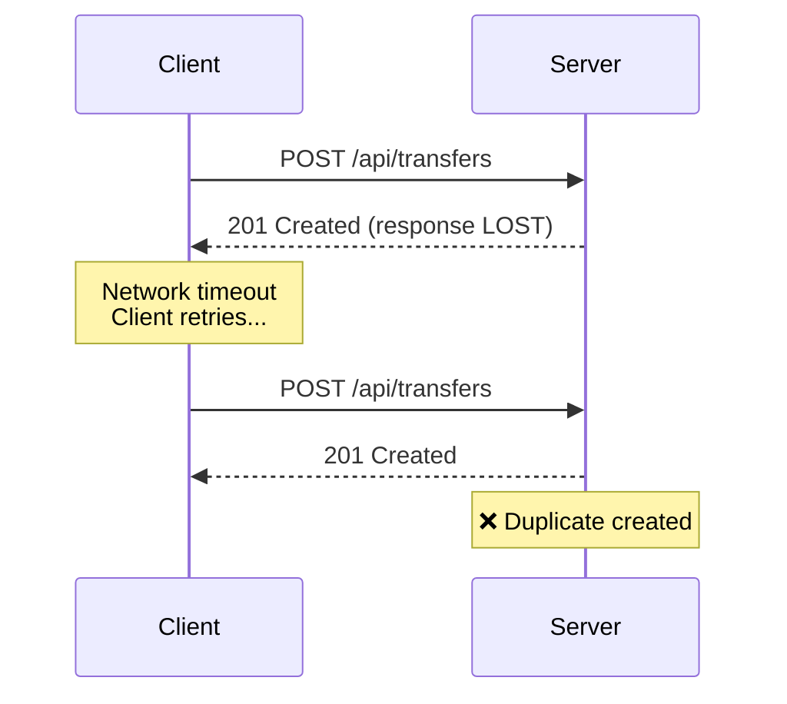
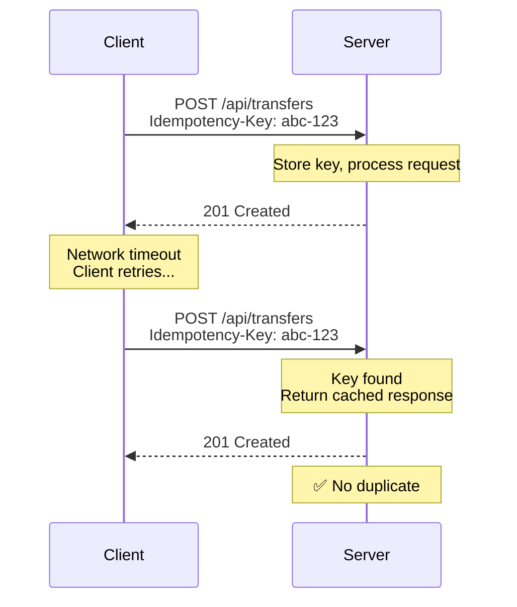

# Why Idempotency Matters

In distributed systems, networks timeout, load balancers retry, users double-click. Without idempotency, these failures create duplicate transactions: double charges, duplicate orders, inconsistent state.

## The Problem

Duplicate requests happen more often than you'd think:

| Cause            | Example                               |
| ---------------- | ------------------------------------- |
| User behavior    | Double-clicking a submit button       |
| Client retries   | Automatic retry on connection timeout |
| Network issues   | Request succeeds but response is lost |
| Load balancers   | Backend timeout triggers retry        |
| Webhook delivery | Provider retries failed deliveries    |

Each duplicate request creates side effects: duplicate payments, duplicate orders, corrupted data.

## The Pattern

Major APIs like Stripe and PayPal use a simple pattern to solve this:

1. **Client generates a unique key** — typically a UUID for each unique operation
2. **Key sent as header** — `Idempotency-Key: <uuid>`
3. **Server stores key + response** — in your database or cache
4. **On duplicate request** — server returns cached response instead of reprocessing

This makes any request safely retryable. The server either processes it once and caches the result, or recognizes the key and returns the previous result.

## Benefits

- **Fault tolerance**: Network interruptions don't cause duplicate transactions
- **Simplified retry logic**: Clients can safely retry without complex deduplication
- **Better UX**: Users don't wonder "did that go through?"
- **API reliability**: Stripe, PayPal, and major processors all use this pattern

Idempot-js implements the [IETF Idempotency-Key Header draft specification](https://datatracker.ietf.org/doc/html/draft-ietf-httpapi-idempotency-key-header-07) for Node.js, Bun, and Deno applications.

## Further Learning

<iframe width="560" height="315" src="https://www.youtube-nocookie.com/embed/29NNiZhXe2Q" title="YouTube video player" frameborder="0" allow="accelerometer; autoplay; clipboard-write; encrypted-media; gyroscope; picture-in-picture; web-share" referrerpolicy="strict-origin-when-cross-origin" allowfullscreen></iframe>

**[Try, try again](https://www.youtube.com/watch?v=29NNiZhXe2Q)** — Sam Newman explains the importance of idempotency in distributed systems at LeadDev Berlin 2025.
