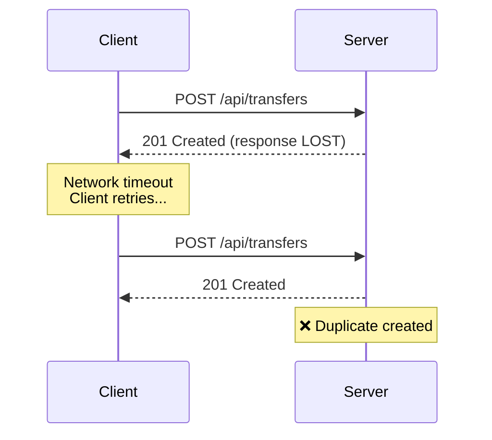
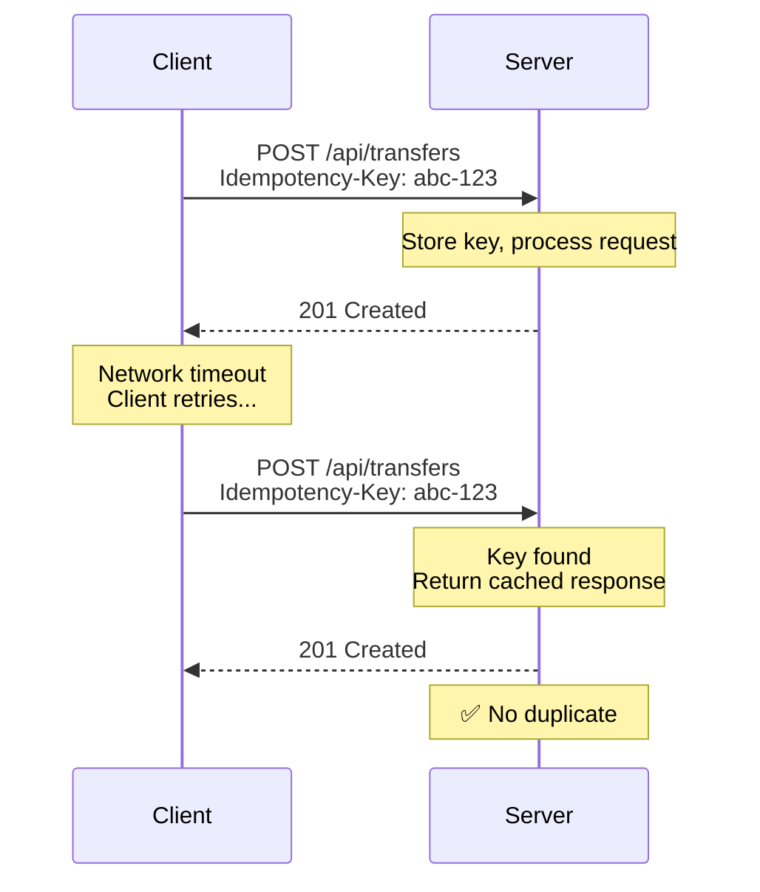

# Learn Section Import Implementation Plan

> **For agentic workers:** REQUIRED SUB-SKILL: Use superpowers:subagent-driven-development (recommended) or superpowers:executing-plans to implement this plan task-by-task. Steps use checkbox (`- [ ]`) syntax for tracking.

**Goal:** Import the /learn/ section from idempot-js VitePress site, replacing the existing "Why Idempotency" page.

**Architecture:** Add mermaid plugin support to VitePress, copy 5 learn pages from idempot-js with context modifications for framework-specific code, convert sidebar from array to object format for path-specific sidebars, update navigation to replace "Why Idempotency" with "Learn".

**Tech Stack:** VitePress 2.0, vitepress-plugin-mermaid 2.0.17, Markdown, Mermaid diagrams

---

## Task 1: Add Mermaid Plugin Dependency

**Files:**

- Modify: `package.json`

- [ ] **Step 1: Add vitepress-plugin-mermaid dependency**

Open `package.json` and add the mermaid plugin to devDependencies after vitepress:

```json
"devDependencies": {
  "@commitlint/cli": "^20.5.0",
  "@commitlint/config-conventional": "^20.5.0",
  "@eslint/js": "^10.0.1",
  "eslint": "^10.1.0",
  "eslint-config-prettier": "^10.1.8",
  "globals": "^17.4.0",
  "husky": "^9.1.7",
  "lint-staged": "^16.4.0",
  "prettier": "^3.8.1",
  "vitepress": "^2.0.0-alpha.17",
  "vitepress-plugin-mermaid": "^2.0.17"
}
```

- [ ] **Step 2: Install dependencies**

Run: `npm install`

Expected: Dependencies install successfully, package-lock.json updates.

- [ ] **Step 3: Verify installation**

Run: `grep vitepress-plugin-mermaid package-lock.json`

Expected: Shows vitepress-plugin-mermaid entry with version 2.0.17.

- [ ] **Step 4: Commit**

```bash
git add package.json package-lock.json
git commit -m "chore: add vitepress-plugin-mermaid dependency"
```

---

## Task 2: Configure Mermaid in VitePress

**Files:**

- Modify: `.vitepress/config.mjs`

- [ ] **Step 1: Import mermaid plugin**

Add import at the top of `.vitepress/config.mjs`:

```javascript
import { defineConfig } from "vitepress";
import { withMermaid } from "vitepress-plugin-mermaid";
```

- [ ] **Step 2: Wrap configuration with mermaid**

Replace the export statement to wrap with `withMermaid`:

```javascript
export default withMermaid(
  defineConfig({
    srcDir: "docs",

    title: "idempot.dev",
    description: "Idempotency middlewares for resilient APIs",

    sitemap: {
      hostname: "https://idempot.dev/"
    },

    markdown: {
      mermaid: true
    },

    vite: {
      optimizeDeps: {
        include: [
          "dayjs",
          "@braintree/sanitize-url",
          "debug",
          "cytoscape",
          "cytoscape-cose-bilkent"
        ]
      }
    },

    head: [
      [
        "script",
        {
          async: true,
          src: "https://plausible.io/js/pa-9RIBzBG_R4o5GyH7c1n9C.js"
        }
      ],
      [
        "script",
        {},
        "window.plausible=window.plausible||function(){(plausible.q=plausible.q||[]).push(arguments)},plausible.init=plausible.init||function(i){plausible.o=i||{}};plausible.init()"
      ]
    ],

    themeConfig: {
      lastUpdated: true,
      nav: [
        { text: "Home", link: "/" },
        { text: "Why Idempotency", link: "/why-idempotency" },
        { text: "Specs", link: "/specs" }
      ],
      sidebar: [
        {
          text: "Documentation",
          items: [
            { text: "Why Idempotency", link: "/why-idempotency" },
            { text: "Specifications", link: "/specs" }
          ]
        },
        {
          text: "Projects",
          items: [
            {
              text: "idempot-js",
              link: "https://github.com/idempot-dev/idempot-js"
            }
          ]
        }
      ],
      socialLinks: [{ icon: "github", link: "https://github.com/idempot-dev" }]
    }
  })
);
```

- [ ] **Step 3: Verify configuration loads**

Run: `npm run dev`

Expected: Development server starts without errors.

- [ ] **Step 4: Stop dev server**

Press: `Ctrl+C`

- [ ] **Step 5: Commit**

```bash
git add .vitepress/config.mjs
git commit -m "feat: configure mermaid diagram support in vitepress"
```

---

## Task 3: Create Learn Directory and Index Page

**Files:**

- Create: `docs/learn/index.md`

- [ ] **Step 1: Create learn directory**

Run: `mkdir -p docs/learn`

- [ ] **Step 2: Create index.md**

Read source: `~/code/idempot-dev/idempot-js/docs/learn/index.md`

Create `docs/learn/index.md` with identical content (no modifications needed for index):

```markdown
# Learn

Idempotency is essential for reliable distributed systems. When networks fail and clients retry requests, idempotency prevents duplicate transactions—no double charges, no duplicate orders.

## Key Concepts

### Why Idempotency Matters

Every API that processes payments, creates orders, or modifies state needs idempotency. Without it, network failures and client retries create duplicate transactions. **[Learn why →](/learn/why)**

### Duplicated vs Repeated Operations

Idempotency protects against duplicates from retries while allowing legitimate repeated operations. Use a different idempotency key for each distinct business operation. **[Learn the difference →](/learn/duplicated-vs-repeated)**

### Client Key Strategies

How should you generate idempotency keys? Learn patterns for managing keys in your client applications. **[See strategies →](/learn/client-key-strategies)**

### IETF Specification

This library implements the IETF draft standard for idempotency keys. Understanding the spec helps you implement idempotency correctly and interoperate with other systems. **[Read the spec compliance guide →](/learn/spec)**

## What You'll Learn

- The problem duplicates create in distributed systems
- How the idempotency-key pattern works
- What the IETF specification requires
- Implementation details for each requirement
```

- [ ] **Step 3: Verify file created**

Run: `ls -la docs/learn/`

Expected: Shows `index.md` file.

- [ ] **Step 4: Commit**

```bash
git add docs/learn/index.md
git commit -m "docs: add learn section index page"
```

---

## Task 4: Create Why Idempotency Page with Diagrams

**Files:**

- Create: `docs/learn/why.md`

- [ ] **Step 1: Read source file**

Read source: `~/code/idempot-dev/idempot-js/docs/learn/why.md`

- [ ] **Step 2: Create why.md**

Create `docs/learn/why.md` with the following content (exact copy from idempot-js, preserving mermaid diagrams and YouTube embed):

````markdown
# Why Idempotency Matters

In distributed systems, networks timeout, load balancers retry, users double-click. Without idempotency, these failures create duplicate transactions: double charges, duplicate orders, inconsistent state.

## The Problem

Duplicate requests happen more often than you'd think:

| Cause            | Example                               |
| ---------------- | ------------------------------------- |
| User behavior    | Double-clicking a submit button       |
| Client retries   | Automatic retry on connection timeout |
| Network issues   | Request succeeds but response is lost |
| Load balancers   | Backend timeout triggers retry        |
| Webhook delivery | Provider retries failed deliveries    |


````

Each duplicate request creates side effects: duplicate payments, duplicate orders, corrupted data.

## The Pattern

Major APIs like Stripe and PayPal use a simple pattern to solve this:

1. **Client generates a unique key** — typically a UUID for each unique operation
2. **Key sent as header** — `Idempotency-Key: <uuid>`
3. **Server stores key + response** — in your database or cache
4. **On duplicate request** — server returns cached response instead of reprocessing



This makes any request safely retryable. The server either processes it once and caches the result, or recognizes the key and returns the previous result.

## Benefits

- **Fault tolerance**: Network interruptions don't cause duplicate transactions
- **Simplified retry logic**: Clients can safely retry without complex deduplication
- **Better UX**: Users don't wonder "did that go through?"
- **API reliability**: Stripe, PayPal, and major processors all use this pattern

Idempot-js implements the [IETF Idempotency-Key Header draft specification](https://datatracker.ietf.org/doc/html/draft-ietf-httpapi-idempotency-key-header-07) for Node.js, Bun, and Deno applications.

## Further Learning

<iframe width="560" height="315" src="https://www.youtube-nocookie.com/embed/29NNiZhXe2Q" title="YouTube video player" frameborder="0" allow="accelerometer; autoplay; clipboard-write; encrypted-media; gyroscope; picture-in-picture; web-share" referrerpolicy="strict-origin-when-cross-origin" allowfullscreen></iframe>

**[Try, try again](https://www.youtube.com/watch?v=29NNiZhXe2Q)** — Sam Newman explains the importance of idempotency in distributed systems at LeadDev Berlin 2025.

````

- [ ] **Step 3: Commit**

```bash
git add docs/learn/why.md
git commit -m "docs: add why idempotency page with mermaid diagrams"
````

---

## Task 5: Create Duplicated vs Repeated Page with Context

**Files:**

- Create: `docs/learn/duplicated-vs-repeated.md`

- [ ] **Step 1: Read source file**

Read source: `~/code/idempot-dev/idempot-js/docs/learn/duplicated-vs-repeated.md`

- [ ] **Step 2: Create duplicated-vs-repeated.md with context note**

Copy the entire content from idempot-js source, then add the context note. The content should be identical to the source file `~/code/idempot-dev/idempot-js/docs/learn/duplicated-vs-repeated.md`, with this addition:

After the `## Server Implementation` heading (line 93 in source), add before the code block:

```markdown
**Note:** The following example uses idempot-js middleware with the Hono framework. For framework-specific implementations, see the [idempot-js documentation](https://github.com/idempot-dev/idempot-js).
```

The file should maintain all original content including:

- Table comparing Duplicated vs Repeated
- Example with monthly invoice payments
- Request model JavaScript code
- HTTP request examples
- Server implementation code
- Summary table

- [ ] **Step 3: Commit**

```bash
git add docs/learn/duplicated-vs-repeated.md
git commit -m "docs: add duplicated vs repeated page with framework context"
```

---

## Task 6: Create Client Key Strategies Page

**Files:**

- Create: `docs/learn/client-key-strategies.md`

- [ ] **Step 1: Read source file**

Read source: `~/code/idempot-dev/idempot-js/docs/learn/client-key-strategies.md`

- [ ] **Step 2: Create client-key-strategies.md**

Copy the entire content from `~/code/idempot-dev/idempot-js/docs/learn/client-key-strategies.md` without modifications. The file contains:

- Strategy 1: Random Keys (with JavaScript code example)
- Strategy 2: Database ID as Key (with JavaScript code example)
- Benefits of each approach

No context notes needed - code examples are pure JavaScript patterns, not framework-specific.

- [ ] **Step 3: Commit**

```bash
git add docs/learn/client-key-strategies.md
git commit -m "docs: add client key strategies page"
```

---

## Task 7: Create Spec Compliance Page

**Files:**

- Create: `docs/learn/spec.md`

- [ ] **Step 1: Read source file**

Read source: `~/code/idempot-dev/idempot-js/docs/learn/spec.md`

- [ ] **Step 2: Create spec.md with context note**

Copy the entire content from `~/code/idempot-dev/idempot-js/docs/learn/spec.md`, then add context note. After the `## Implemented Requirements` heading (line 8 in source), add:

```markdown
**Note:** This page describes idempot-js implementation of the IETF specification. For other implementations, refer to your framework's documentation.
```

The file should maintain all original content including:

- MUST requirements table
- SHOULD requirements table
- MAY requirements table
- Error responses table
- What's not covered section
- Compliance status

- [ ] **Step 3: Commit**

```bash
git add docs/learn/spec.md
git commit -m "docs: add IETF spec compliance page with implementation context"
```

---

## Task 8: Update Navigation and Sidebar

**Files:**

- Modify: `.vitepress/config.mjs`

- [ ] **Step 1: Update navigation**

Replace the nav section to change "Why Idempotency" to "Learn":

```javascript
nav: [
  { text: "Home", link: "/" },
  { text: "Learn", link: "/learn/" },
  { text: "Specs", link: "/specs" }
];
```

- [ ] **Step 2: Convert sidebar to object format**

Replace the entire sidebar array with object format for path-specific sidebars:

```javascript
sidebar: {
  "/learn/": [
    {
      text: "Learn",
      items: [
        { text: "Overview", link: "/learn/" },
        { text: "Why Idempotency", link: "/learn/why" },
        { text: "Duplicated vs Repeated", link: "/learn/duplicated-vs-repeated" },
        { text: "Client Key Strategies", link: "/learn/client-key-strategies" },
        { text: "Spec Compliance", link: "/learn/spec" }
      ]
    }
  ],
  "/": [
    {
      text: "Documentation",
      items: [
        { text: "Specifications", link: "/specs" }
      ]
    },
    {
      text: "Projects",
      items: [
        {
          text: "idempot-js",
          link: "https://github.com/idempot-dev/idempot-js"
        }
      ]
    }
  ]
}
```

Note: "Why Idempotency" is removed from Documentation section since it's now under Learn.

- [ ] **Step 3: Verify configuration**

Run: `npm run dev`

Navigate to `http://localhost:5173/learn/`

Expected: Learn index page loads with correct sidebar.

- [ ] **Step 4: Stop dev server**

Press: `Ctrl+C`

- [ ] **Step 5: Commit**

```bash
git add .vitepress/config.mjs
git commit -m "feat: update navigation to add learn section, remove why-idempotency"
```

---

## Task 9: Delete Old Why Idempotency Page

**Files:**

- Delete: `docs/why-idempotency.md`

- [ ] **Step 1: Delete file**

Run: `rm docs/why-idempotency.md`

- [ ] **Step 2: Verify deletion**

Run: `git status`

Expected: Shows `deleted: docs/why-idempotency.md`

- [ ] **Step 3: Commit**

```bash
git add docs/why-idempotency.md
git commit -m "docs: remove old why-idempotency page (replaced by learn section)"
```

---

## Task 10: Run Tests and Verify

**Files:**

- None (testing only)

- [ ] **Step 1: Start development server**

Run: `npm run dev`

- [ ] **Step 2: Test learn index page**

Navigate to: `http://localhost:5173/learn/`

Expected: Learn index page loads with sidebar showing all 5 pages.

- [ ] **Step 3: Test mermaid diagrams**

Navigate to: `http://localhost:5173/learn/why`

Expected: Two sequence diagrams render correctly after "The Problem" and "The Pattern" sections.

- [ ] **Step 4: Test YouTube embed**

On `/learn/why`, scroll to bottom.

Expected: YouTube video embed appears and can be played.

- [ ] **Step 5: Test sidebar navigation**

Click each sidebar link:

- Overview → /learn/
- Why Idempotency → /learn/why
- Duplicated vs Repeated → /learn/duplicated-vs-repeated
- Client Key Strategies → /learn/client-key-strategies
- Spec Compliance → /learn/spec

Expected: Each page loads correctly.

- [ ] **Step 6: Test internal links**

On `/learn/`, click "Learn why →"

Expected: Navigates to `/learn/why`

- [ ] **Step 7: Test code examples with syntax highlighting**

Navigate to: `http://localhost:5173/learn/duplicated-vs-repeated`

Expected: JavaScript/Hono code examples display with syntax highlighting.

- [ ] **Step 8: Test top navigation**

Click "Learn" in top nav.

Expected: Navigates to `/learn/`

- [ ] **Step 9: Stop dev server**

Press: `Ctrl+C`

- [ ] **Step 10: Build for production**

Run: `npm run build`

Expected: Build completes successfully without errors.

- [ ] **Step 11: Preview production build**

Run: `npm run preview`

Navigate to: `http://localhost:4173/learn/`

Expected: Production build works correctly with all pages accessible.

- [ ] **Step 12: Stop preview**

Press: `Ctrl+C`

---

## Task 11: Final Verification

- [ ] **Step 1: Check git status**

Run: `git status`

Expected: Working tree clean (all changes committed).

- [ ] **Step 2: Review commit history**

Run: `git log --oneline -n 10`

Expected: See all 9 commits in order:

1. chore: add vitepress-plugin-mermaid dependency
2. feat: configure mermaid diagram support in vitepress
3. docs: add learn section index page
4. docs: add why idempotency page with mermaid diagrams
5. docs: add duplicated vs repeated page with framework context
6. docs: add client key strategies page
7. docs: add IETF spec compliance page with implementation context
8. feat: update navigation to add learn section, remove why-idempotency
9. docs: remove old why-idempotency page (replaced by learn section)

- [ ] **Step 3: Verify file structure**

Run: `find docs/learn -type f`

Expected:

```
docs/learn/client-key-strategies.md
docs/learn/duplicated-vs-repeated.md
docs/learn/index.md
docs/learn/spec.md
docs/learn/why.md
```

- [ ] **Step 4: Confirm old file deleted**

Run: `ls docs/why-idempotency.md`

Expected: `No such file or directory`

---

## Success Criteria

✓ All 5 learn pages accessible at /learn/\* paths
✓ Mermaid diagrams render correctly
✓ YouTube video embeds properly
✓ Navigation works for both desktop and mobile
✓ Internal links between learn pages work correctly
✓ Code examples display with syntax highlighting
✓ Production build succeeds
✓ All 9 commits in logical order with descriptive messages
